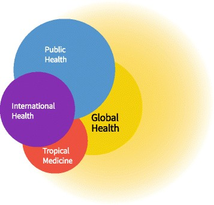
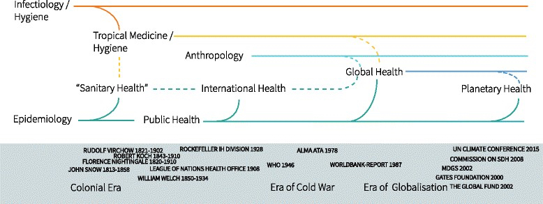
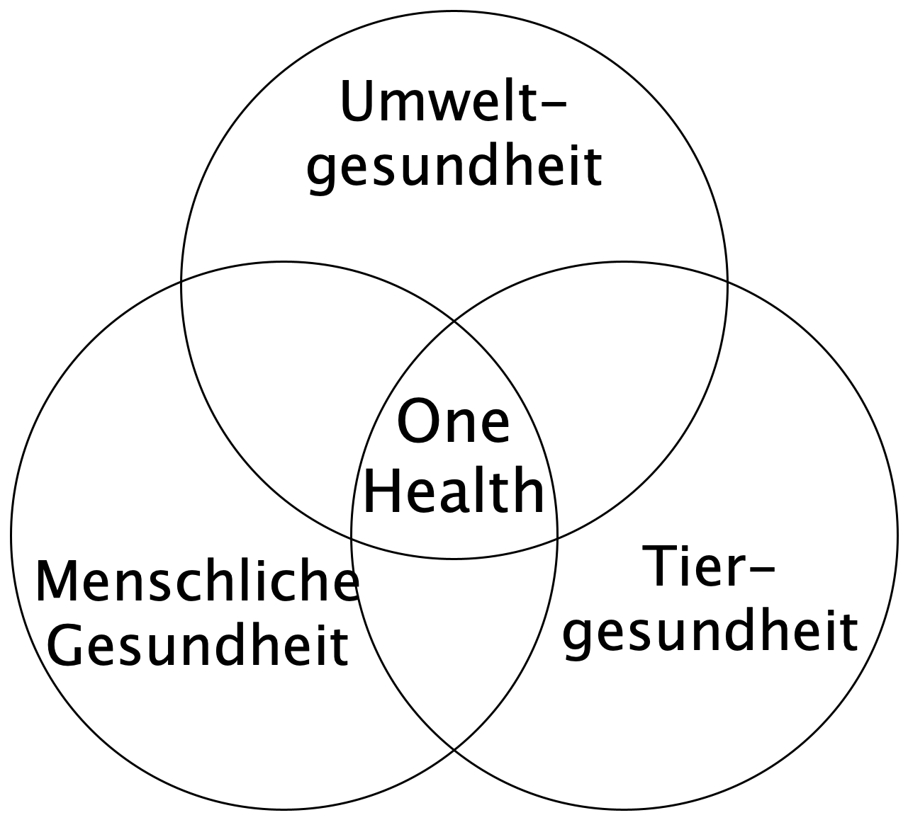
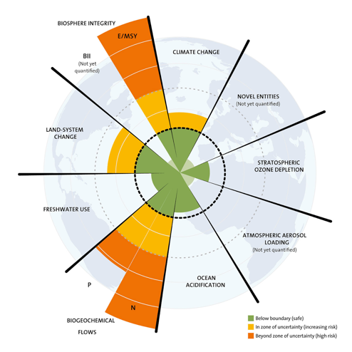
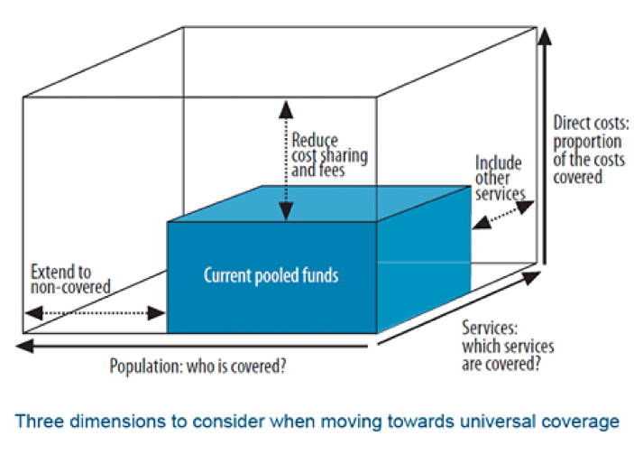
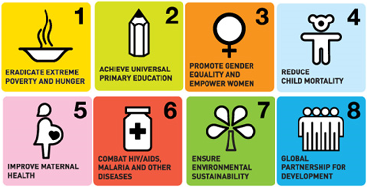
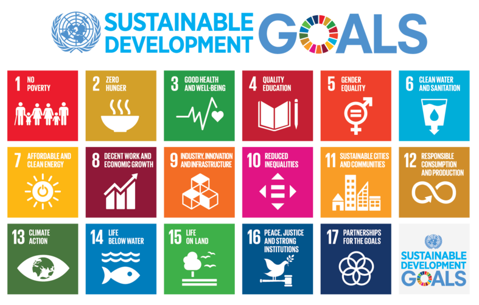

### Nach Lesen dieses Kapitels können Sie: {#H2491841}

-   Grundbegriffe und Konzepte der Öffentlichen und Globalen Gesundheit
    benennen.

-   Unterschiedliche Definitionen des Begriffs Globale Gesundheit und
    damit verbundene Unschärfen erklären.

-   Die Begriffe Globale Gesundheit, Internationale Gesundheit,
    Öffentliche Gesundheit (*Public Health*), Eine Gesundheit (*One
    Health*), Planetare Gesundheit (*Planetary Health*) einordnen.

-   Die Ergebnisse der "Krankheitslaste" (*Burden of Disease*)-Studie als wichtige Quelle für globale epidemiologische Trends einordnen.

-   Unterschiede von Gesundheitsgerechtigkeit/-fairness (*Health
    Equity*) und Gesundheitsgleichheit (*Health Equality*) und den damit
    verbundenen Konzepten erklären.

-   Die wichtigsten Grundsätze der Konzepte Basisgesundheitsversorgung
    (*Primary Health Care*), Soziale Determinanten von Gesundheit
    (*Social Determinants of Health*), Allgemeine Gesundheitsversorgung
    (*Universal Health Coverage*), Gesundheit in allen Politikbereichen
    (*Health in all Policies*), Nachhaltige Entwicklungsziele
    (*Sustainable Development Goals*), Internationale
    Gesundheitsvorschriften (*International Health Regulations*),
    Zentrale Aufgaben im Bereich Öffentliche Gesundheit (*Essential
    Public Health Operations*), sowie einige der nationalen
    Rechtsgrundlagen wie das Präventionsgesetz, die
    Gesundheitsdienstgesetze und das Infektionsschutzgesetz erläutern.

Viele Studierende und Berufstätige beschäftigen sich im Zusammenhang mit
einem Auslandsaufenthalt und mit Berichten über die Gesundheit der
Bevölkerung ihres Gastlandes oder mit internationalen
Gesundheitsvergleichen mit dem Thema Globale Gesundheit und finden dabei
auch Interesse an Öffentlichen Gesundheitsfragen in Deutschland. Erst
später wird dann oft erkannt, wie relevant weltweite Aspekte für
Gesundheit auch für bevölkerungsmedizinische Aspekte in Deutschland zu
verstehen sind.

Im Folgenden werden einige Grundbegriffe und Konzepte aus der Globalen
und Öffentlichen Gesundheit vorgestellt die im Laufe der letzten
Jahrzehnte Maßstäbe gesetzt haben oder die regelmäßig in aktuellen
Debatten zu globaler Gesundheit erwähnt werden und die sich
kontinuierlich weiterentwickeln. Die Darstellung erhebt keinen Anspruch
auf Vollständigkeit und ist als Anreiz gedacht, sich weiter mit diesen
Konzepten zu beschäftigen.

Auf einzelne Strategiepapiere, Aktionspläne, oder relevante Dokumente zu
spezifischen Themenfeldern, wie z.B. Mutter/Kind Gesundheit,
vernachlässigte Tropenkrankheiten, nicht übertragbare Erkrankungen,
etc., wird im Folgenden nicht eingegangen.

Grundbegriffe {#H8955086}
-------------

### **Globale Gesundheit** {#H1820012}

Der Begriff **Globale Gesundheit (*****Global Health*****)** wird in den
letzten Jahrzehnten unterschiedlich ausgelegt. Dies bedingt Diskussionen
über Eingrenzungen, Begriffsschärfe und Abgrenzungen zu anderen
Konzepten. Bei der Einordnung des Begriffes ist zu berücksichtigen, dass
bei unterschiedlichen Akteuren verschiedene Konzepte darunter verstanden
werden, und diese Unterschiede oft nicht explizit werden. Daher ist
anzunehmen, das eine Kommunikation über Globale Gesundheit oft zu
Missverständnissen führt. So wird Globale Gesundheit etwa als
akademisches Fach, als Berufsfeld, als werteorientierte Haltung, als
Frage nationaler Sicherheit, oder auch manchmal auch als neues Label für
alles was bisher internationale Gesundheit hieß, verstanden.

Eine gängige Definition beschreibt Globale Gesundheit als
interdisziplinäres und multidisziplinäres Gebiet, welches Themen
umfasst, die sowohl die Gesundheit einzelner Menschen, d.h. auf
individueller Ebene, als auch auf Bevölkerungsebene betreffen, einer
globalen Zusammenarbeit bedürfen und bei denen gesundheitliche
Chancengleichheit und soziale Gerechtigkeit eine große Rolle spielen.
(Koplan et al. 2009)

Die Nationale Akademie der Wissenschaft Leopoldina beschreibt Global
Health 2015 als:

> *„Global Health reicht über nationale Grenzen und Regierungen hinaus
> und muss sich in dieser Eigenschaft mit den vielfältigen Determinanten
> von Gesundheit befassen – mit den sozialen, wirtschaftlichen und
> umweltbedingten – sowie mit der globalen Krankheitslast. Sie hält
> viele multisektorale Herausforderungen bereit und braucht starke,
> globale Governance-Institutionen.“* (Nationale Akademie der
> Wissenschaften Leopoldina, acatech – Deutsche Akademie der
> Technikwissenschaften 2015)

Eine 2018 veröffentlichte Studie befragte Lehrende im Bereich Globale
Gesundheit aus Deutschland zu ihrem Verständnis der Disziplin. Ein
zentrales Ergebnis ist das Verständnis von Globale Gesundheit als
sogenannter übergeordneter Begriff (*umbrella term*) (Havemann and
Bösner 2018). Globale Gesundheit hat damit eigenständige Kernbereiche,
vor allem im Sinne der supraterritorialen Determinanten von Gesundheit,
kann aber auch eine ganze Reihe weiterer Aspekte aus klassischen
Disziplinen wie Öffentliche Gesundheit, Internationale Gesundheit oder
Tropenmedizin abdecken (Bozorgmehr 2010).

Themen und Herausforderungen Globaler Gesundheit sind auf globaler,
nationaler, regionaler und lokaler Ebene relevant für die Gesundheit auf
bevölkerungs- und individualmedizinischer Ebene. Dabei beschränkt sich
Globale Gesundheit weder auf sozial- noch biomedizinische Aspekte,
sondern integriert diese in einem interdisziplinären Ansatz.
Interdisziplinär bedeutet hierbei, dass keiner Disziplin eine
"Fachhoheit" zukommt, sondern dass alle die Disziplinen beteiligt werden
sollen, die für Lösungsansätze für ein oder auch den Umgang mit einem
Problem, z.B. Klimawandel, Antimikrobielle Resistenzen, benötigt werden.

Globale Gesundheit beinhaltet oftmals normative Komponente: Es geht um
die Förderung und Aufrechterhaltung von Gesundheitsgerechtigkeit. Dies
bedeutet, dass auf dem Weg zur Erreichung des Ziels **Gesundheit für
Alle** (*health for all*) vor allem diejenigen Gruppen gefördert werden,
die besonders vulnerabel und deren Lebensumstände besonders
vernachlässigt sind. Neben der Frage der unterschiedlichen Definitionen
spielt die Perspektive aus der Globale Gesundheit gelehrt, beforscht und
praktiziert wird eine wichtige Rolle.

Zur Verdeutlichung dieses Spannungsfelds kann man sich an den Ansätzen
von Cole et al. sowie von Labonté et al. orientieren. Während Cole et
al. ein eigenes Modell im akademischen Kontext entwickeln, analysieren
Labonté und Gagnon die Diskurse zu Globale Gesundheit aus einer "Policy"
Perspektive, also entlang konkreter politischer Initiativen oder Ziele
(Cole, Jackson, and Forman 2017; Labonte and Gagnon 2010). Eine dritte
Perspektive berücksichtigt die räumliche Dimension von Globaler
Gesundheit, welche sich in lokale, -nationale und globale Aktionsfelder
gliedert.

Die Akteure dieser Aktionsfelder sind in Kapitel 3 genauer beschrieben.
Die verschiedenen Ansätze sind in Tabelle 1 visualisiert.

Tabelle 1: Unterschiedliche Ansätze in der Globalen Gesundheit

Die Entwirrung und Bewusstwerdung verschiedener Ansätze in Globaler
Gesundheit kann dazu beitragen, sich des eigenen Verständnisses sowie
eigener Handlungskontextes in Globaler Gesundheit klarer zu werden.

### **Internationale Gesundheit** {#H9404754}

Der Begriff **Internationale Gesundheit (International Health)** hat
historische Bezüge zu den Bereichen von Tropenmedizin und Hygiene. Es
bestehen große Schnittmengen zu Globaler Gesundheit, jedoch gibt es auch
Ansätze der Abgrenzung. So werden unter Internationale Gesundheit eher
bilaterale Aktivitäten, mit Fokus auf Gesundheitsprobleme in Ländern mit
geringen und mittleren Einkommen, die aus Ländern mit hohen Einkommen
unterstützt werden, verstanden. (Koplan et al. 2009)

Die Abgrenzung zu Globale Gesundheit sind aus Sicht dieser Autoren
transnationale Gesundheitsprobleme, die nur durch interdisziplinäre und
transnationale Kollaboration gelöst werden können (bspw. Tabakkontrolle,
Übergewicht, Pandemien, Klimazerstörung u.a.). Es ist zu beobachten,
dass auf Grund der Popularität des Begriffes Globale Gesundheit viele
Initiativen und z.T. auch Institute von Internationale zu Globaler
Gesundheit umbenannt werden, bisweilen jedoch unter Beibehaltung der
bisherigen Aktivitätsschwerpunkte. 

### **Öffentliche Gesundheit** {#H1156730}

Der Begriff der Öffentlichen Gesundheit bezeichnet – analog dem
englischen Begriff "*Public Health*" – die Wissenschaft und Praxis,
durch organisierte gesellschaftliche Anstrengungen Krankheit zu
vermeiden, Leben zu verlängern, und Gesundheit zu fördern
(Nachwuchsnetzwerks Öffentliche Gesundheit  2019).

Bei der Abgrenzung der Begriffe Public Health, Öffentliche Gesundheit
und Globale Gesundheit handelt es sich um eine viel diskutierte und
andauernde Debatte. Dieses Buch soll zur einer Erweiterung des
Verständnisses und zur Darlegung gemeinsamer Schnittstellen und
überlappender Bereiche in Theorie und Praxis beitragen.

Nach Koplan et al (2009) fokussiert sich Public Health auf den
Gesundheitszustand innerhalb einer Nation und verlangt selten globale
Kooperation (Koplan et al. 2009). Dieser Sichtweise wurde vielfach
widersprochen und der Begriff "Global Public Health" zunehmend ins Spiel
gebracht (Fried et al. 2010; Beaglehole and Bonita 2010).

Insgesamt ist festzuhalten, dass die Abgrenzungen der Begriffe entlang
unklarer Linien verlaufen, und es jeweils breite Überlappungsbereiche
gibt. Havemann und Bösner haben 2018 auf der Basis von Interviews mit
Lehrenden in Global Health in Deutschland folgende hilfreiche Grafiken
entwickelt, die näherungsweise den Stand der aktuellen Diskussion
abbilden (Havemann and Bösner 2018).

Abbildung 1: Der Begriff Globale Gesundheit als Überbegriff (aus Havemann &
Bösner, 2018)

In ihren visuellen Darstellungen sind sie auf die zeitliche Entwicklung
der Disziplin Globale Gesundheit, mit Ursprüngen und
Vorläuferdisziplinen eingegangen und haben diese in Bezug gesetzt. Auch
auf die neuere Disziplin der **Planetaren Gesundheit (Planetary
Health)** sind sie eingegangen und haben sie in ihrem Konzept
integriert. 

Abbildung 2: Die Entstehung und Entwicklung der Bezeichnung

### **Eine Gesundheit** {#docs-internal-guid-6aa892e7-7fff-a888-4aa0-74c1de29e512}

Unter dem Begriff **Eine Gesundheit (One Health)** versteht man einen
transdisziplinären Ansatz, um die systematischen Zusammenhänge und
Wechselwirkungen der Gesundheit von Menschen, Tieren und Pflanzen sowie
der Umwelt in den Blick zu nehmen.

Hintergrund ist u.a. der Klimawandel, die zunehmende globale Bedeutung
von Zoonosen, die vermehrte grenzüberschreitende Ausbreitung von
Krankheitserregern, die Intensivierung der Lebensmittelproduktion sowie
die zunehmende Bedeutung von antimikrobiellen Resistenzen, um nur einige
der Herausforderungen zu nennen.

Abbildung 3: One Health - als Verbindung zwischen Umwelt, Tier und
menschlicher Gesundheit

### **Planetare Gesundheit** {#docs-internal-guid-11606073-7fff-d0f9-8a3b-34cf8c6b4649}

Der Begriff von **Planetarer Gesundheit (Planetary Health)** stammt aus
einem Kommentar im Lancet von 2014, auf welchen aufbauend 2015 die
[Rockefeller Foundation-Lancet Commission on Planetary
Health](https://www.thelancet.com/commissions/planetary-health "https://www.thelancet.com/commissions/planetary-health")
begründet wurde (Horton et al. 2014).

Planetare Gesundheit wird komplementär zu den oben genannten Begriffen
verwendet und teils als Erweiterung des Begriffes Global Health
verstanden, teils als zu Globale Gesundheit zugehöriges Themenfeld
beschrieben. Im Zentrum von Planetarer Gesundheit stehen die
Wechselwirkungen der Gesundheit der Menschen und der Ressourcen des
Planeten, von welchen die Gesundheit abhängt. Es ist daher ein
Schnittpunkt zwischen Gesundheits- und Umwelt-/ bzw.
Naturwissenschaften. Klimawandel, Reduktion der Biodiversität,
Umweltverschmutzung und Fragen zu nachhaltigen Ernährungsformen sind
zentrale Elemente von Planetarer Gesundheit. Welche Herausforderungen
sich daraus ergeben, zeigt das Konzept der Planetaren Grenzen. Planetare
Grenzen sind Prozesse, welche die Stabilität und Resilienz auf der Erde
bestimmen und im Rahmen derer sich die Menschheit weiterentwickeln kann.
Das Überschreiten der Grenzen führt zu möglicherweise unumkehrlichen
Veränderungen der Umwelt (Rockström et al. 2009). Aus dem umfassenden
Charakter des Konzeptes Planetare Gesundheit lässt sich die
Notwendigkeit interdisziplinärer Lösungsansätze und lokaler, nationaler
und globaler Zusammenarbeit ableiten. Die Notwendigkeit zu umfassender
Transformation in Bereichen von z.B. Mobilität, Ernährung und
Energieversorgung mit dem Ziel der Reduktion von sowohl klimaschädlichen
als auch gesundheitsschädlichen Emissionen wird als zunehmend dringlich
wahrgenommen, um ein gutes und gesundes Überleben der menschlichen
Zivilisation auf diesem Planeten zu ermöglichen. Es werden zahlreiche
weitere Vorteile, sogenannte *Co-Benefits*, beschrieben, die sowohl dem
Schutz des Klimas und der Umwelt als auch der menschlichen Gesundheit
dienen. In diesem Kontext gewinnt das Konzept Planetare Gesundheit
aktuell zunehmend an Bedeutung.

Abbildung 4: Veränderung der Kontrollvariablen von Planetaren Grenzen, grüne
Flächen markieren Räume, die nachhaltige Entwicklung ermöglichen (P=
Phosphorus, N= Nitrogen, BII= Functional diversity, E/MSY= Genetic
diversity). Quelle: Stockholm Resilience Centre)

### Gesundheitsberichterstattung des Bundes {#H9823844}

Die **Gesundheitsberichterstattung** (GBE) des Bundes berichtet
regelmäßig über die gesundheitliche Lage und die gesundheitliche
Versorgung der Bevölkerung in Deutschland. Sie ist eine gemeinsame
Aufgabe des Robert Koch-Instituts (RKI) und des Statistischen
Bundesamtes. Themen reichen von Krankheiten und Beschwerden über das
Gesundheitsverhalten und Risikofaktoren bis hin zur medizinischen und
pflegerischen Versorgung und der damit verbundenen Kosten. In die GBE
fließen Daten des Gesundheitsmonitorings, anderer epidemiologischer
Studien, amtliche Statistiken, epidemiologischer Register und
Routinedaten der Sozialversicherungsträger ein. (Robert Koch-Institut
2019)

Daten der GBE in Deutschland stehen Entscheidungsträgern für Ansätze,
die Bevölkerungsgesundheit zu verbessern, zur Verfügung und fließen in
internationale Abschätzungen des globalen Gesundheitszustandes mit ein.
Die Menge und Qualität von Daten, welche über Gesundheit gesammelt
werden, variiert im weltweiten Vergleich stark.

### Die Studie zu Globaler Gesundheitslast {#H4314499}

Was sind die größten gesundheitlichen Probleme der Welt? Wie erfolgreich
geht die Menschheit diese Probleme an? Wie wird Gesundheitsversorgung
finanziert und wie können wir Ressourcen bestmöglich einsetzen, um die
Gesundheit der Weltbevölkerung zu verbessern?

Globale Gesundheitsdaten, die standardisiert erfasst und vergleichbar
ausgewertet werden, können helfen, derartige Fragestellungen auf Basis
empirischer Erkenntnisse zu beantworten. Die **Studie zu Globaler
Gesundheitslast (Global Burden of Disease Study)** ist die wohl
meistgenutzte Quelle für Informationen über die Gesundheit von
Bevölkerungen weltweit (Institute for Health Metrics and Evaluation
(IHME) 2017). Aktuelle Ergebnisse bestätigen den Trend einer weltweit
zunehmenden Lebenserwartung, weisen auf anhaltende Versorgungs- und
Finanzierungslücken hin und zeigen, wie sich die Hauptursachen der
Krankheitslast auf der ganzen Welt immer ähnlicher werden. Jedoch ist zu
berücksichtigen, dass die beschriebenen Veränderungen in der globalen
Gesundheit oft nicht gemessen, sondern anhand begrenzt verfügbarer Daten
geschätzt werden.

Zu den Gesundheitsindikatoren, welche die GBD Studie berechnet, zählen

-   **Lebenserwartung (*****Life Expectancy, LE*****)** misst die Anzahl
    der Lebensjahre, die ein Mensch in einem bestimmten Alter
    voraussichtlich noch leben wird. Ohne Altersangabe, bezieht sich die
    Lebenserwartung auf den Zeitpunkt der Geburt.

-   **Gesunde Lebenserwartung (*****Healthy Life Expectancy,
    HALE*****)** drückt die Lebenserwartung unter Berücksichtigung des
    voraussichtlichen Gesundheitszustands aus. Lebensjahre, für die eine
    gesundheitliche Beeinträchtigung erwartet wird, werden bei der
    gesunden Lebenserwartung mit einem Faktor für die voraussichtliche
    Beeinträchtigung des Gesundheitszustands multipliziert.

-   **Mit Beeinträchtigung gelebte Lebensjahre (*****Years Lived with
    Disability, YLDs*****)** sind die Anzahl von Jahre, die mit
    gesundheitlichen Einschränkungen erlebt werden. Dazu zählen
    Erkrankungen, die nur wenige Tage bis Wochen andauern (z. B. eine
    Grippe), ebenso wie Erkrankungen, die ein Leben lang bestehen
    bleiben (z. B. Formen der Epilepsie). Mit Beeinträchtigung gelebte
    Lebensjahre werden abgeschätzt, indem die Häufigkeit einer
    Erkrankung mit einem Faktor für deren Auswirkung auf den
    Gesundheitszustand multipliziert wird. Diese Faktoren werden mit
    Hilfe von Befragungen der Allgemeinbevölkerung entwickelt.

-   **Durch vorzeitigen Tod verlorene Lebensjahre (*****Years of Life
    Lost, YLLs*****)** sind Jahre, die durch vorzeitige Sterblichkeit
    verloren gehen. Diese werden berechnet, indem das Todesalter von der
    höchsten Lebenserwartung eines Menschen in diesem Alter abgezogen
    wird. Wenn zum Beispiel die höchste Lebenserwartung für Männer in
    einem bestimmten Land 75 Jahre beträgt, ein Mann aber mit 65 Jahren
    an einer Krebserkrankung stirbt, wären das 10 Jahre verlorenes Leben
    durch die Krebserkrankung.

-   **Beeinträchtigungsbereinigte Lebensjahre (*****Disability Adjusted
    Life Years, DALYs*****)** sind ein Maß der Krankheitslast und
    entsprechen der Summe aus durch vorzeitigen Tod verlorenen
    Lebensjahren (YLLs) und mit Beeinträchtigung gelebter Lebensjahre
    (YLDs). Ein DALY entspricht einem verlorenen gesunden Lebensjahr.
    Dieser Gesundheitsindikator kann genutzt werden, um krankheits-,
    länder- oder personenübergreifend die Gesamtzahl der Lebensjahre
    abzuschätzen, die aufgrund bestimmter Krankheiten und Todesursachen
    mit Beeinträchtigung bzw. nicht gelebt werden.

Die Studie zur globalen Krankheitslast (engl. [Global Burden of Disease
Study](%20%20http://www.healthdata.org/gbd "  http://www.healthdata.org/gbd"))
versucht aufgrund verfügbarer Daten, ähnlich der
Gesundheitsberichterstattung des Bundes in Deutschland, für die globale
gesundheitliche Situation Daten zur Verfügung zu stellen. Die Menge,
Qualität und Vergleichbarkeit von Daten, welche über die Gesundheit
gesammelt werden, variiert im weltweiten Vergleich erheblich, sodass
jährlich veröffentlichte Ergebnisse der Global Burden of Disease Studie
in hohem Maße auf statistischer Modellierung beruhen.

(In den Abschnitten über die Global Burden of Disease Studie wurden
Inhalte aus Kohler (2019) übernommen.)

Konzepte {#H4562065}
--------

### **Basisgesundheitsversorgung** {#H9900682}

Im Jahr 1978 konnte der damalige Generaldirektor der
Weltgesundheitsorganisation Halfdan Mahler einen Konsens für eine
Änderung der Gesundheitspolitik erreichen. Bis dahin herrschten
vornehmlich vertikale (erkrankungsspezifische) und
erkrankungsorientierte Herangehensweisen vor, oft mit dem Ziel der
Infektionskontrolle (z.B. Malaria, Tuberkulose, Pocken). Obwohl
erfolgreich in manchen Bereichen, z.B. bei der Pockeneradikation, gab es
keine Erfolge in anderen Bereichen, z.B. Malaria-Bekämpfung. Eine
sogenannte vertikale Herangehensweise berücksichtigt Verbindungen, die
zwischen unterschiedlichen Erkrankungen oder zu sozioökonomischen und
umweltbedingten Einflussfaktoren auf die Gesundheit bestehen, oftmals
nicht umfassend. Dieser Ansatz führte auch nicht zu einer Stärkung der
Gesundheitssysteme. (Lindstrand et al. 2006)

Gegen Ende der 70er Jahre erfolgte ein Richtungswechsel. In der Alma-Ata
Konferenz 1978 wurde die **Basisversorgung (Primary Health Care**,
PHC**)** Strategie beschlossen mit dem Slogan: „*Gesundheit für alle im
Jahr 2020*“. (World Health Organisation 1978) Die Grundelemente für die
zukünftige öffentliche Gesundheit wurden dort gelegt: 

1.  Fokus auf die Lebensweise und Bedürfnisse der Bevölkerung, Priorität
    für die vulnerablen Gruppen und Fokus auf gesundheitliche
    Chancengleichheit

2.  Integration in das nationale Gesundheitssystem

3.  Intersektorale Herangehensweise (Landwirtschaft, Bildung, Wasser,
    …) 

4.  Teilhabe der Bevölkerung in der Suche nach Lösungen

5.  Nutzung von lokalen Ressourcen unter Berücksichtigung derer
    eingeschränkten Verfügbarkeit

6.  Integration und Koordination von gesundheitsfördernden, präventiven,
    kurativen und rehabilitativen Maßnahmen und Berücksichtigung der
    breiten Determinanten von Gesundheit

7.  dezentralisierte Dienste, so nah wie möglich an den Menschen. (World
    Health Organisation 1978; Lindstrand et al. 2006; World Health
    Organisation 2019a)

Die Konferenz in Alma Ata läutete die Entwicklung hin zur
gemeindebasierten Medizin ein, weg vom rein kurativen hin zu gemischten
präventiv-kurativen Ansätzen, weg von einer sogenannte "von-oben-herab"
(*top-down*) Herangehensweise hin zur Gemeindeorientierung und
Beteiligung (*participation*), mit dem Ziel, dass alle Menschen den
höchst erreichbaren Standard an Gesundheit erreichen können. Aus
unterschiedlichen Gründen wurden die ehrgeizigen Ziele der Alma Ata
Erklärung nicht erreicht. Unter anderem fehlten Pläne für deren
Umsetzung, eine ausreichende Finanzierung wurde nicht geklärt, und auf
die ökonomischen Krisen der 80er folgte die Verbreitung von neoliberalen
Ansätzen mit der Folge des Abbaus von öffentlichen
Infrastrukturen. (Farmer et al. 2013)

Im Jahr 1986 wurde in Ottawa, Kanada, die sogenannte "*[Ottawa Charta
for Health
Promotion](https://www.who.int/healthpromotion/conferences/previous/ottawa/en/ "https://www.who.int/healthpromotion/conferences/previous/ottawa/en/")"*
unter Federführung der WHO verabschiedet. Darin wurde das Konzept der
Gesundheitsförderung eingeführt. Es zielt unter anderem auf Gestaltung
der gesundheitsrelevanten politischen, sozialen, ökonomischen,
kulturellen biologischen Faktoren und Umweltbedingungen. Es gilt als ein
Folgedokument der Erklärung von Alma Ata und wurde in Folgekonferenzen
weiterentwickelt und ausdifferenziert. (World Health Organisation 1986)

In den 2000er Jahren verschob sich der Fokus auf Reformen der
Gesundheitssysteme mit dem Ziel, die Qualität und die Zugänglichkeit von
Gesundheitsdienstleistungen zu ermöglichen. Kritik an der Umsetzung der
Basisversorgung und Rufe nach "Revitalisierung" des Konzepts auf der
Basis der Erfahrungen der vorangegangenen drei Dekaden und der
zunehmenden Evidenz wurden immer lauter (Lawn et al. 2008). Vierzig
Jahre nach Alma Ata wurde 2018 die Astana Erklärung verabschiedet, in
welcher die Prinzipien der primären Basisversorgung zur Verbesserung des
Gesundheitsstatus durch umfassende und integrierte Versorgung und
Adressierung der Gesundheitsdeterminanten unter Partizipation und
Befähigung (*empowerment*) der Bevölkerung erneut bekräftigt wurden.
(World Health Organisation 2018)

### **Gesundheits(un)gerechtigkeit und Gesundheits(un)gleichheit** {#H8301138}

Die Ähnlichkeit der englischen Begriffe, so wie die Schwierigkeit, sie
ins Deutsche zu übersetzen, führen oftmals zu Unschärfen. ***Health
(In)equity*** bezieht sich am ehesten auf
**Gesundheits(un)gerechtigkeiten**, während ***Health (In)equality*** am
ehesten mit **Gesundheits(un)gleichheiten** übersetzt werden kann.

Abbildung 5: Illustration der Konzepte Equality & Equity (Illustration:
Angus Maquire, https://www.storybasedstrategy.org)

Diese zwei Begriffe unterscheiden sich in einem wichtigen Aspekt
voneinander: Von einer Gesundheitsungleichheit spricht man, wenn sich
Morbiditäts- oder Mortalitätsziffern in unterschiedlichen
Bevölkerungsgruppen auf Grund von unveränderlichen Merkmalen (wie Alter,
biologisches Geschlecht, genetische Faktoren) unterscheiden. Einige
Ungleichheiten lassen sich nicht vermeiden (so sind beispielsweise
Männer auf Grund ihres biologischen Geschlechts nicht von
Müttersterblichkeit betroffen).

Von Health Inequity (manchmal auch ***Health Disparity*** genannt) -
also am ehesten mit Ungerechtigkeit zu übersetzen - spricht man, wenn
sich Gesundheitsdaten verschiedener Bevölkerungsgruppen voneinander
unterscheiden auf Grund von Einflüssen, die veränderbar wären.  Dies
sind beispielsweise der sozioökonomische Status, Zugang zu
Gesundheitsversorgung, sexuelle Orientierung, Bildungsstatus oder
Umweltfaktoren die durch die Wohnverhältnisse determiniert werden (z.B.
Luftverschmutzung, Lärm, sanitäre Versorgung usw.). Damit sind die
Verringerung von Health Inequities ein originäres Handlungsfeld von
Anstrengungen im Bereich Globale und Öffentliche Gesundheit. 

Als **Vertikale Gerechtigkeit (*****Vertical Equity*****)** wird dabei
der Ansatz bezeichnet, das ausgehend von unterschiedlichen
Ausgangsvoraussetzungen unterschiedliche Individuen je nach ihren
Bedürfnissen Anrecht auf unterschiedliche Ressourcen haben sollten. Ein
anschauliches Beispiel dafür sind beispielsweise Vergünstigungen in
vielen Lebensbereichen für Menschen mit Behinderungen. Dieses Konzept
ist eng verknüpft mit dem Begriff der Sozialen Determinanten von
Gesundheit, der im Folgenden erläutert wird.

### **Soziale Determinanten von Gesundheit** {#H6252727}

Die Gesundheit von Menschen hängt nicht nur von der medizinischen
Versorgung im Erkrankungsfall, sondern maßgeblich auch von den
Umständen, unter den Menschen auf die Welt kommen, aufwachsen, leben,
arbeiten und älter werden, ab. Diese Umstände wiederum sind maßgeblich
geprägt von den sozialen, politischen, kulturellen und ökonomischen
Systemen und Institutionen, die die Lebensrealitäten der Menschen
bestimmen. In der Praxis heißt das:  Armut macht krank und Reiche leben
länger.  Die Weltgesundheitsorganisation (WHO) hat hierfür den Begriff
der **Sozialen Determinanten für Gesundheit** geprägt, der 2008 von der
Kommission für Soziale Determinanten für Gesundheit veröffentlichte
Bericht "[Closing the Gap in a generation - Health equity through action
on the social determinants of
health](https://www.who.int/social_determinants/thecommission/finalreport/en/ "https://www.who.int/social_determinants/thecommission/finalreport/en/")"
dient dabei als maßgebliches und viel zitiertes Grundlagendokument.
(World Health Organisation 2008)

In der medizinischen Ausbildung sind Lehrinhalte zu SDHs bislang an
vielen Stellen unzureichend verankert (Hommes et al. 2020a; 2020b).

Aufgabe der Öffentlichen Gesundheit ist es, mit Blick auf diese
Determinanten die Ursachen gesundheitlicher Defizite zu bekämpfen, bevor
sie zu Problemen führen.

### **Allgemeine Gesundheitsversorgung/-sicherung** {#H6328207}

Mit dem Konzept der**allgemeinen Gesundheitsversorgung/-sicherung
(*****Universal Health Coverage, UHC*****)** wird auf die Tatsache
reagiert, dass die Hälfte der Weltbevölkerung keinen Zugang zu
essentiellen Gesundheitsdienstleistungen hat und dass geschätzte 100
Millionen Menschen im Jahr als Folgen ihrer Gesundheitsausgaben von
extremer Armut bedroht sind (World Health Organisation 2019b).

Das Konzept UHC beinhaltet dabei, dass Individuen und
Bevölkerungsgruppen Zugang zu den Gesundheitsdienstleistungen haben
sollten, die sie brauchen, ohne dabei zu verarmen. UHC beinhaltet das
gesamte Spektrum an essentiellen qualitativen
Gesundheitsdienstleistungen - von Gesundheitsförderung zu Prävention,
Behandlung, Rehabilitation und palliativer Versorgung.

Dabei sollten die signifikantesten Ursachen für Morbidität und
Mortalität berücksichtigt werden. UHC soll zudem sicherstellen, dass die
Qualität der Gesundheitsdienstleistungen ausreichend ist für eine
Verbesserung des Gesundheitsstatus (übersetzt nach (World Health
Organisation 2019b)).

Abbildung 6: Visuelle Darstellung unterschiedlicher UHC Dimensionen

UHC ist also ein Konzept, dass nicht nur die Gesundheitsfinanzierung und
die Vermeidung von Armut verursachenden Gesundheitsausgaben umfasst,
sondern auch Qualität, Zugänglichkeit und Verfügbarkeit der
Gesundheitsdienstleistungen sicherstellen soll (World Health
Organisation 2020). Dazu zählen also neben der Erbringung von
Dienstleistungen, auch Arbeitskräfte, Infrastrukturen und Technologie,
Informationssysteme, Qualitätssicherung, Governance und Gesetzgebung. Im
UHC Konzept werden allerdings sozioökonomische oder umweltbezogene
Determinanten von Gesundheit nicht adressiert. Verschiedene dazu nötige
Dimensionen, wie beispielsweise welche Bevölkerungsgruppe (population)
soll durch welche Dienstleistungen (*services*) erreicht werden, was
sollen die Dienstleistungen umfassen (*coverage*) und wie sollen die
Dienstleistungen bezahlbar gemacht werden (cost *affordability*), werden
in der Abbildung: Visuelle Darstellung unterschiedlicher UHC Dimensionen
gezeigt (World Health Organisation 2020).

Als Teil der UN Nachhaltigkeitsziele haben die UN-Mitgliedsländer
vereinbart, UHC bis 2030 flächendeckend zu verwirklichen (SDG 3.8).

### Gesundheit in allen Politikbereichen {#docs-internal-guid-f852275c-7fff-25f7-5f93-f6a076e0d1d1}

Nach dem Konzept **Gesundheit in allen Politikbereichen (Health in all
Policies, HIAP)**der WHO ist die Gesundheitsförderung, Prävention und
Gesundheitsversorgung nicht allein eine Aufgabe des Gesundheitssystems,
sondern auch aller übriger Politikbereiche. Die zahlreichen
Determinanten von Gesundheit berücksichtigend, sollte Gesundheit daher
in allen Themenfeldern des öffentlichen und politischen Handelns
verfolgt werden.

In der 2013 verabschiedeten Helsinki-Erklärung der 8. Weltkonferenz zur
Gesundheitsförderung der WHO wird HIAP definiert als ein Konzept

> „f*ür die Politik in allen Sektoren, die Auswirkungen von
> Entscheidungen auf Gesundheit und Gesundheitssysteme berücksichtigt,
> Synergien sucht und schädliche Auswirkungen auf die Gesundheit
> vermeidet, um die Gesundheit der Bevölkerung und gesundheitliche
> Chancengleichheit zu verbessern*" (Pan American Health
> Organisation/World Health Organisation 2013)

Es gibt bereits international und national Beispiele für die Anwendung
von HIAP, hierzu wird auf die [Übersicht vom Zukunftsforum Public
Health](https://zukunftsforum-public-health.de/health-in-all-policies/ "https://zukunftsforum-public-health.de/health-in-all-policies/")
verwiesen.

### **Nachhaltige Entwicklungsziele** {#H371989}

Die internationale Gesundheitspolitik wurde auf der Grundlage von PHC
mit sich verändernden Akzenten weiterentwickelt. Im Jahr 2000 wurden die
**Millennium- Entwicklungsziele (*****Millenium Development Goals,
MDGs*****)** von den Mitgliedsländern der Vereinten Nationen (*United
Nations, UN)* einstimmig beschlossen (United Nations 2015a). Es wurden
im Jahr 2000 acht Ziele, die bis zum Jahr 2015 erreicht werden sollten
(gemessen auf der Basis der Daten von 1990), von einer Arbeitsgruppe aus
Vertretern der Vereinten Nationen, der Weltbank, des Internationalen
Währungs Fonds und des Entwicklungsausschusses Development Assistance
Committee der OECD formuliert.

Millenium Development Goals

Der [MDG Bericht
2015](https://www.undp.org/content/undp/en/home/librarypage/mdg/the-millennium-development-goals-report-2015/ "https://www.undp.org/content/undp/en/home/librarypage/mdg/the-millennium-development-goals-report-2015/")
gibt einen Überblick über die Indikatoren (United Nations 2015b).

Im Jahr 2015 wurden die MDGs durch die **17 Nachhaltigkeitsziele
(*****Sustainable development Goals, SDG*****)** und die **Agenda
2030**abgelöst. Deren Entwicklung ging ein breiter Beteiligungsprozess
zahlreicher Akteure, inklusive der Zivilgesellschaft, voraus. Im
Gegenteil zu den MDGs, deren Ziele sich vorwiegend auf Länder mit
geringen Einkommen bezogen, betreffen die SDGs alle Länder. Die 17 Ziele
umfassen einen Katalog von 169 Zielvorgaben unterteilt in 107
inhaltliche Ziele und 62 Umsetzungs-Maßnahmen. 

Abbildung 7: Nachhaltige Entwicklungsziele (Sustainable Development Goals,
SDGs)

Gesundheit in den SDGs findet sich im Ziel 3 wieder:

> *“Ein gesundes Leben für alle Menschen jeden Alters gewährleisten und
> ihr Wohlergehen fördern”*

Die Zielvorgaben sind folgende: 

1.  Bis 2030 die weltweite Müttersterblichkeit auf unter 70 je 100.000
    Lebendgeburten senken.

2.  Bis 2030 den vermeidbaren Todesfällen bei Neugeborenen und Kindern
    unter 5 Jahren ein Ende setzen, mit dem von allen Ländern zu
    verfolgenden Ziel, die Sterblichkeit bei Neugeborenen mindestens auf
    12 je 1.000 Lebendgeburten und bei Kindern unter 5 Jahren mindestens
    auf 25 je 1.000 Lebendgeburten zu senken.

3.  Bis 2030 die Aids-, Tuberkulose- und Malariaepidemien und die
    vernachlässigten Tropenkrankheiten beseitigen und Hepatitis, durch
    Wasser übertragene Krankheiten und andere übertragbare Krankheiten
    bekämpfen.

4.  Bis 2030 die vorzeitige Sterblichkeit aufgrund von nicht
    übertragbaren Krankheiten durch Prävention und Behandlung um ein
    Drittel senken und die psychische Gesundheit und das Wohlergehen
    fördern.

5.  Die Prävention und Behandlung des Substanzmissbrauchs, namentlich
    des Suchtstoffmissbrauchs und des schädlichen Gebrauchs von Alkohol,
    verstärken.

6.  Bis 2020 die Zahl der Todesfälle und Verletzungen infolge von
    Verkehrsunfällen weltweit halbieren.

7.  Bis 2030 den allgemeinen Zugang zu sexual- und
    reproduktionsmedizinischer Versorgung, einschließlich
    Familienplanung, Information und Aufklärung, und die Einbeziehung
    der reproduktiven Gesundheit in nationale Strategien und Programme
    gewährleisten.

8.  Die allgemeine Gesundheitsversorgung, einschließlich der Absicherung
    gegen finanzielle Risiken, den Zugang zu hochwertigen grundlegenden
    Gesundheitsdiensten und den Zugang zu sicheren, wirksamen,
    hochwertigen und bezahlbaren unentbehrlichen Arzneimitteln und
    Impfstoffen für alle erreichen.

9.  Bis 2030 die Zahl der Todesfälle und Erkrankungen aufgrund
    gefährlicher Chemikalien und der Verschmutzung und Verunreinigung
    von Luft, Wasser und Boden erheblich verringern.

 In Deutschland sind die SDGs in die deutsche Nachhaltigkeitsstrategie
eingeflossen (Die Bundesregierung 2018a).

### **Internationale Gesundheitsvorschriften** {#H9881112}

Die **Internationale Gesundheitsvorschriften (*****International Health
Regulations*****)** sind völkerrechtlich bindende Vorschriften der
Weltgesundheitsorganisation (World Health Organisation 2005). Sie wurden
1969 beschlossen, ersetzten die bis dahin geltenden International
Sanitary Regulations und zielten auf Seuchenbekämpfung ab. Diese sahen
die Meldung von Krankheitsfällen (z.B. Cholera, Pest, Gelbfieber) an die
WHO sowie gesundheitsbezogene Regeln für internationalen Handel,
internationale Reisen und organisatorischen Vorgaben zum
Gesundheitsschutz vor. Sie legten auch die Notwendigkeit von bestimmten
Gesundheitsdokumenten fest (Impfpässe für Reisende aus Endemiegebieten,
Seegesundheitserklärung, etc).

Mit der Zunahme des internationalen Verkehrs für Menschen und Waren
sowie das Auftreten neuer Krankheitserreger (z.B. HIV, SARS, aviäre
Influenza, Ebola) zeigte sich, dass Gesundheitsrisiken nicht mehr auf
eine Region begrenzt bleiben und das Krankheitsausbrüche früh entdeckt
werden müssen, um eine internationale Verbreitung verhindern zu können.
Aufgrund dieses dringenden Bedarfes wurde das internationale Rahmenwerk
2005 novelliert. Die **Internationale Gesundheitsvorschriften**
enthalten verpflichtende Regelungen sowohl für staatliche Akteure,
internationale Transporteure und die WHO selbst. Erstere sollen
beispielsweise ein Surveillancesystem etablieren und Maßnahmen
vorhalten, um die Verschleppung von Krankheiten in anderen Ländern zu
verhindern. International tätige Transportunternehmen sollen der
Verbreitung von Krankheiten durch eigene Kontrollen an Waren, Passagiere
und Besatzung entgegenwirken. Die WHO steht in Dauerbereitschaft
beratend an der Seite der Mitgliedsländer.

### **Zentrale Aufgaben im Bereich der Öffentlichen Gesundheit** {#H9277010}

Zur Stärkung und Vereinheitlichung der Aufgaben und Strukturen
definierte die WHO Europa zehn so genannte **zentrale Aufgaben im
Bereich der Öffentlichen Gesundheit (*****Essential Public Health
Operations, EPHO*****)**. Diese sollen aus Sicht der WHO eine effiziente
Umsetzung von Zielen der Öffentlichen Gesundheit ermöglichen:

> EPHO1: Surveillance of population health and wellbeing
>
> EPHO2: Monitoring and response to health hazards and emergencies
>
> EPHO3: Health protection including environmental occupational, food
> safety and others
>
> EPHO4: Health promotion including action to address social
> determinants and health inequity
>
> EPHO5: Disease prevention, including early detection of illness
>
> EPHO6: Assuring governance for health and wellbeing
>
> EPHO7: Assuring a sufficient and competent public health workforce
>
> EPHO8: Assuring sustainable organisational structures and financing
>
> EPHO9: Advocacy communication and social mobilisation for health
>
> EPHO10: Advancing public health research to inform policy and
> practice.

Die EPHOS sind eine wichtige Grundlage, um Aufgaben und Strukturen im
Bereich der Öffentlichen Gesundheit national und lokal zielführend
auszugestalten und so die Bewältigung von Herausforderungen der Globalen
Gesundheit systemeffizient zu ermöglichen.

### **Präventionsgesetz** {#H7561932}

Das**Präventionsgesetz (PrävG)** des Bundes schreibt den gesetzlichen
Krankenkassen vor, Leistungen für Präventionsangebote anzubieten. So
sind in § 20 Abs. 3 PrävG Ziele im Rahmen dieser Leistungen definiert,
die sich an globalen Gesundheitszielen orientieren (z. B. Tabakkonsum
reduzieren, gesund aufwachsen). Hieraus können Akteur/innen vor Ort
beispielsweise im Rahmen von Projektanträgen Gelder akquirieren, um
Gesundheitsziele umzusetzen.

### **Gesundheitsdienstgesetze** {#H1424795}

Die **Gesundheitsdienstgesetze (GDG)** der Länder regeln den Aufbau, die
Zuständigkeiten, Befugnisse und Aufgaben der Einrichtungen des
Öffentlichen Gesundheitsdienstes (ÖGD). Hier sind auch jene definiert,
die sich mit Fragen von globaler Gesundheit beschäftigen. Auch wenn die
meisten GDG sich in Aufbau und Inhalt ähneln, unterscheiden sie sich
dennoch in einzelnen inhaltlichen Punkten.

Deutlich wird dies im Hinblick auf die gesetzlich vorgeschriebenen
Aufgaben im Rahmen von globalen Gesundheitsthemen, wie beispielsweise
Klimawandel und Gesundheit (umweltbezogener Gesundheitsschutz). Während
z. B. das Hessische Gesetz über den öffentlichen Gesundheitsdienst
(HGöGD) in § 8 den Gesundheitsämtern die konkreten Aufgaben Beobachtung,
Bewertung, Beratung der Bevölkerung und Behörden sowie der Stellungnahme
überträgt, sieht das Gesundheitsdienstgesetz (GDG) Berlins in § 10 die
"Abwehr umweltbedingter Gesundheitsgefahren, die vorsorgende
Umwelthygiene und die krankheitsorientierte Umweltmedizin" als Aufgaben
des ÖGDs vor. Das Gesetz über den öffentlichen Gesundheitsdienst des
Landes Nordrhein-Westfalen (ÖGDG NRW) geht in § 10 sogar noch weiter:
hier wird den unteren Gesundheitsbehörden (Gesundheitsämter) sogar eine
Befugnis erteilt, entsprechende Maßnahmen in öffentlichen Gebäuden "zur
Abwehr von gesundheitlichen Schäden oder Langzeitwirkungen" anordnen zu
können.

### **Infektionsschutzgesetz** {#H4572208}

Weitere Aufgaben sind neben den Landesgesetzen auch im
**Infektionsschutzgesetz (IfSG)** des Bundes geregelt. Insbesondere
Meldewege und Zuständigkeiten auf kommunaler, Landes- und Bundesebene
werden durch das IfSG festgelegt. Befugnisse erhält der ÖGD durch das
IfSG, durch die er sogar mehrere bürgerliche Grundrechte Einzelner außer
Kraft setzen kann, um die Gesundheit der Allgemeinheit zu schützen (z.B.
die angeordnete Unterbringung von Menschen mit offener Lungentuberkulose
gegen ihren Willen, bis der Heilungsprozess so weit fortgeschritten ist,
dass die Erkrankung nicht mehr als infektiös einzustufen ist).

### Konzept der Bundesregierung zu Globaler Gesundheit {#H1059051}

Im nationalen Kontext gibt es (bisher, Stand Juni 2020) keine Normen,
die die Handlungsspielräume Deutschlands im Kontext Globale Gesundheit
explizit regeln. Stattdessen gibt es verschiedene Gesetzgebungen und
fachliche Empfehlungen, die sich aus den internationalen und
europäischen Abmachungen ableiten. Diese sind teilweise in
unterschiedlichen Ressorts des Öffentlichen Dienstes (z. B. verschiedene
Bundesministerien) angesiedelt.

Aufgaben und Befugnisse im Rahmen von globalen Gesundheitsthemen lassen
sich im bundesdeutschen Raum eher von Rechtsgrundlagen ableiten, die
sich mit der Förderung oder dem Schutz der Bevölkerungsgesundheit
befassen. Da Gesundheit in Deutschland Länderkompetenz ist,
unterscheiden sich die entsprechenden Landesgesetzgebungen hierbei zum
Teil erheblich voneinander.

Im Koalitionsvertrag 2018 hat die Regierung der Bundesrepublik
Deutschland festgelegt, eine neue Strategie zu Globale Gesundheit zu
erarbeiten (Die Bundesregierung 2018b):

> „*Deutschland wird eine Strategie zur globalen Gesundheitspolitik
> erarbeiten, um noch stärker seiner internationalen Verantwortung
> gerecht zu werden. Schwerpunkte werden die Gesundheitssicherheit und
> die Prävention von internationalen Pandemien sowie Stärkung von
> Gesundheitssystemen in Entwicklungsländern sein. Dafür werden wir
> internationale Kooperationen und strategische Partnerschaften weiter
> aufbauen und ausbauen. Außerdem gilt es, die WHO zu stärken, indem wir
> auch den Reformprozess in der WHO unterstützen*.“ ([Koalitionsvertrag
> 2018 zwischen CDU, CSU und
> SPD](https://www.bundesregierung.de/resource/blob/975226/847984/5b8bc23590d4cb2892b31c987ad672b7/2018-03-14-koalitionsvertrag-data.pdf "https://www.bundesregierung.de/resource/blob/975226/847984/5b8bc23590d4cb2892b31c987ad672b7/2018-03-14-koalitionsvertrag-data.pdf").)

Die neue Strategie zu Globale Gesundheit der Bundesregierung, beruhend
auf dem 2013 verabschiedeten Konzept, wird derzeit (Stand August 2020)
ausgearbeitet und ressortübergreifend abgestimmt (Die Bundesregierung
2013). Sie soll vorausschauend Prioritäten und Grundsätze für
Deutschlands Engagement in Globale Gesundheit setzen, um die nationale
und internationale Zusammenarbeit und Aufgabenteilung zum Erreichen der
Ziele für nachhaltige Entwicklung (SDGs), welche die Vereinten Nationen
in der Agenda 2030 vereinbarten, zu unterstützen.
